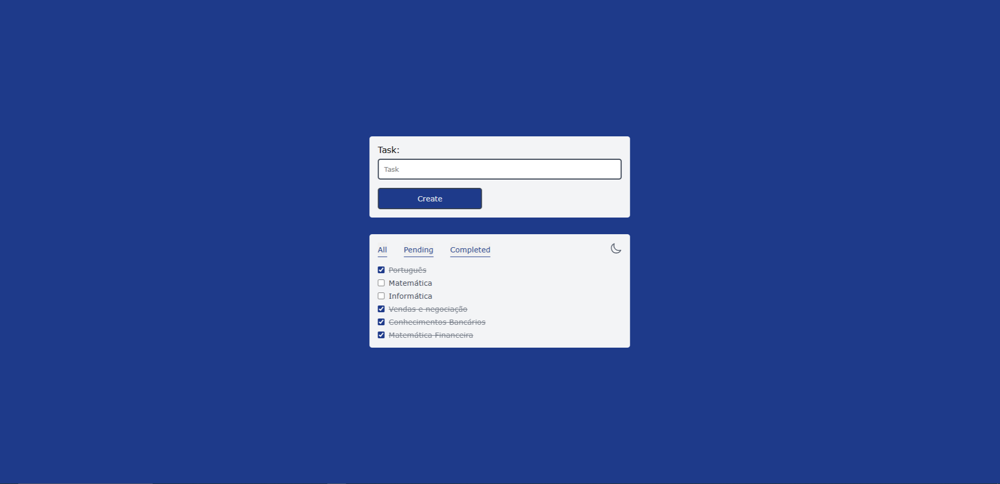

# 📌 Gerenciador de Tarefas
Um gerenciador de tarefas simples e intuitivo, desenvolvido para ajudar na organização do dia a dia.

### ✨ Funcionalidades
✅ Adicionar tarefas 

✅ Marcar tarefas como concluídas

✅ Filtros dinâmicos (Todas, Pendentes e Concluídas)

✅ Modo escuro 🌙

✅ Armazenamento local para salvar suas tarefas

### 🚀 Tecnologias utilizadas
- HTML, 
- CSS,
- JavaScript,
- Manipulação do DOM,
- LocalStorage

### 🎨 Demonstração

📌 Sinta-se à vontade para contribuir ou sugerir melhorias! 🚀